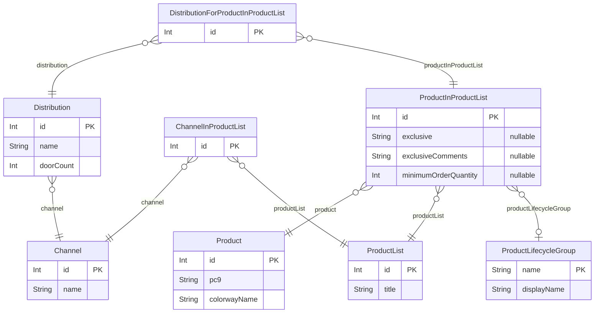

```mermaid
erDiagram

  Product {
    Int id PK 
    String pc9  
    String colorwayName  
    }
  

  ProductList {
    Int id PK 
    String title  
    }
  

  ProductInProductList {
    Int id PK 
    String exclusive  "nullable"
    String exclusiveComments  "nullable"
    Int minimumOrderQuantity  "nullable"
    }
  

  ProductLifecycleGroup {
    String name PK 
    String displayName  
    }
  

  Channel {
    Int id PK 
    String name  
    }
  

  ChannelInProductList {
    Int id PK 
    }
  

  Distribution {
    Int id PK 
    String name  
    Int doorCount  
    }
  

  DistributionForProductInProductList {
    Int id PK 
    }
  
    ProductInProductList o{--|| Product : "product"
    ProductInProductList o{--|| ProductList : "productList"
    ProductInProductList o{--|o ProductLifecycleGroup : "productLifecycleGroup"
    ChannelInProductList o{--|| Channel : "channel"
    ChannelInProductList o{--|| ProductList : "productList"
    Distribution o{--|| Channel : "channel"
    DistributionForProductInProductList o{--|| Distribution : "distribution"
    DistributionForProductInProductList o{--|| ProductInProductList : "productInProductList"
```
